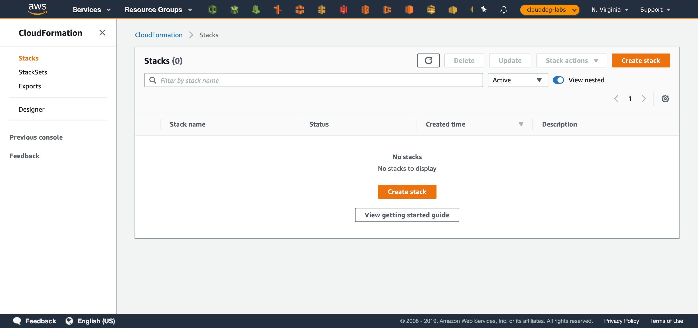
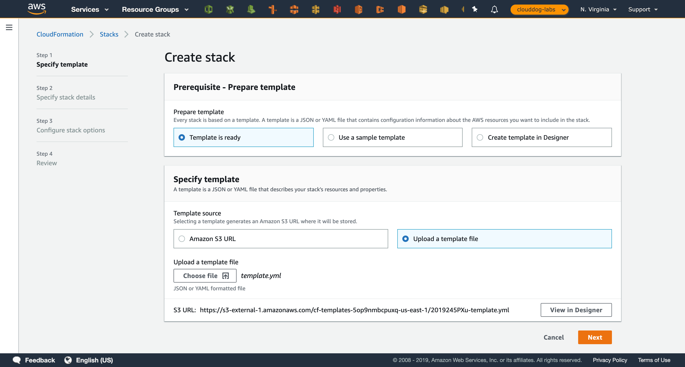
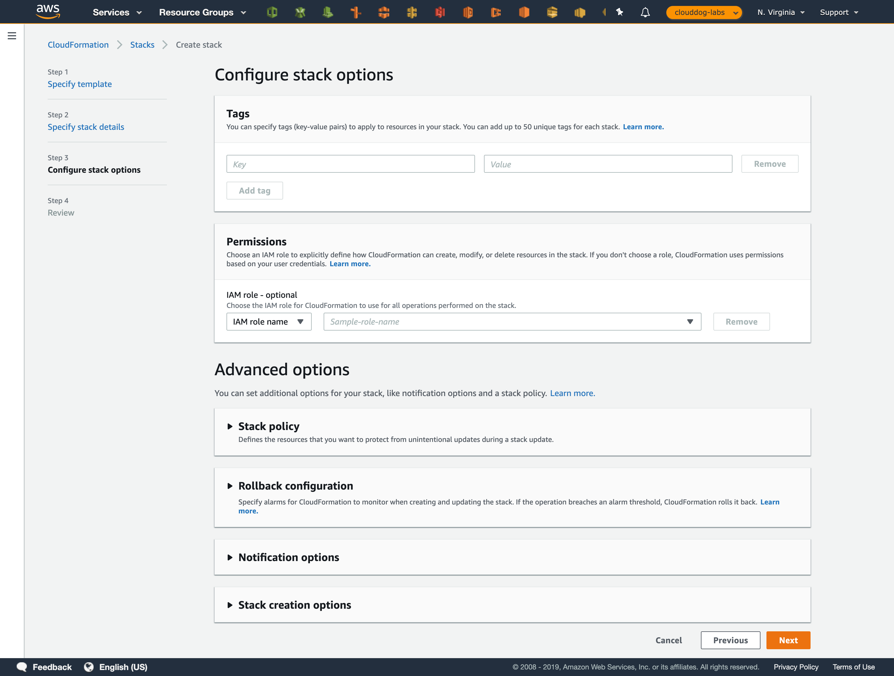
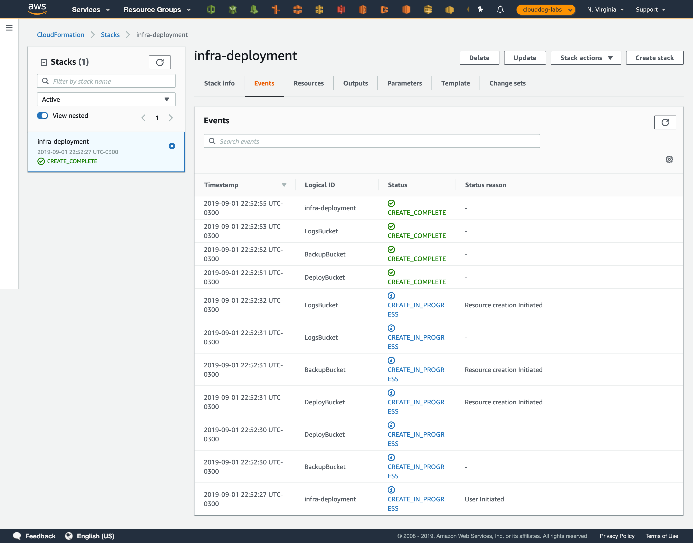

# ead-platform-architecture

A intençao deste repositório é disponibilizar os assets para criaçao da arquitetura abaixo.

# Como utilizar o CloudFormation

# VPC

Para criar a VPC, baixe o template dentro da pasta template/vpc.template 

**Lembre-se de definir as redes sem que ocorra overlap entre as redes do datacenter atual.**
# EKS

Para criar o Cluster de EKS, recomendo seguir o step-by-step da página a seguir: 

https://github.com/BRPSNPO/seminars-aws-series-1/tree/master/05-containers-na-aws#eks
# EC2

Para criar a VPC, baixe o template dentro da pasta template/ec2.template

**Se atente a AMI, ela corresponde a imagem do sistema operacional**

# ElasticCache

To be done
